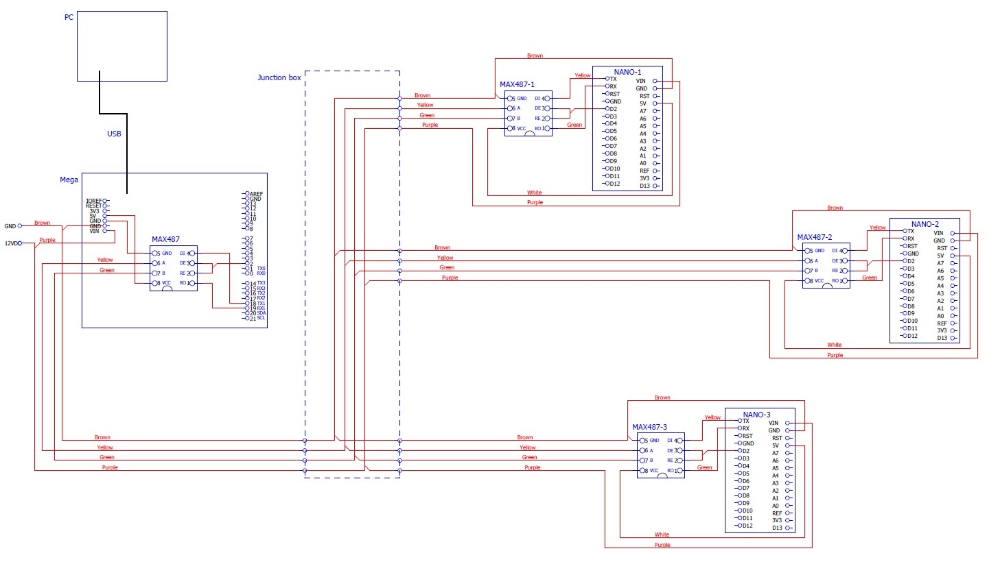

# Multimonitorsetup | Musteranpassungen | JF-17

## Monitorsetup DCS

C:\Users\<YOUR_USERNAME>\Saved Games\DCS\Config\MonitorSetup\ [JF17.lua](JF17.lua) diese Config Datei nicht verwechseln mit der JF-17 für DCS-BIOS, beide liegen hier in der Dokumentation ab 

## JF-17 Musteranpassungen

### MFCD zur Anzeige bringen

DCSWorld\Mods\aircraft\JF-17\Cockpit\Scripts\MFCD\MFCD_init_CENTER.lua
DCSWorld\Mods\aircraft\JF-17\Cockpit\Scripts\MFCD\MFCD_init_LEFT.lua
DCSWorld\Mods\aircraft\JF-17\Cockpit\Scripts\MFCD\MFCD_init_RIGHT.lua

try_find_assigned_viewport('LEFT_MFCD') wurde auskommentiert
try_find_assigned_viewport('RIGHT_MFCD') wurde auskommentiert
try_find_assigned_viewport('CENTER_MFCD') wurde auskommentiert

### Trimmung anzeigen

DCSWorld\Mods\aircraft\JF-17\Cockpit\Scripts\ControlsIndicator\ControlsIndicator_page.lua

local cy = 0.2
local cx = 0

Damit man die Trimmung (STRG + ENTER) auf dem Monitor sehen kann.

# DCS-BIOS Installation

## DCS-BIOS mit JF17 Config installieren und ausführen

1. Install DCS-BIOS https://github.com/DCSFlightpanels/dcs-bios MASTER oder wenn nicht mehr verfügbar die hier abgelegte [zip-datei](dcs-bios-master.zip).
2. Kopieren der scripts Ordner und export.lua
3. connect-serial-port aus dem Verzeichnis ausführen!
4. DCS-BIOS mit der TF51 testen. Bindings von der P51
5. Geänderte [JF-17.lua](JF-17.lua) nutzen durch kopieren in  ....\Scripts\DCS-BIOS\lib (Nicht verwechseln mit der JF17.lua welche dem Multimonitorsetup dient!)

## Browserplugin

1. Install Google Chrome
2. Chrome -> "Settings" -> "More Tools" -> "Extensions", check "Developer mode"
3. Click "Load unpacked extension..." and choose your "C:\Users<username>\Saved Games\DCS\Scripts\DCS-BIOS\doc" folder
4. A new extension "DCS-BIOS Control Reference Live Preview" 
   will be visible under "Apps".
5. Exit "Settings"
6. Start DCS, load a Mission and jump in a Plane
7. Click "Apps" in your Browser. Your DCS-BIOS extension be there. From there you can see the controls change as you fly and manipulate the cockpit. 

# DCS-BIOS Hardware

## MAX487 Schaltplan mit Master und Slave

[Quelle](https://forums.eagle.ru/showthread.php?t=243611)

## Nutzbare PINS am Slave (Arduino Nano)

2 ist belegt, dient der seriellen Kommunikation

Somit verbleiben Digital (Pink) PIN D3 - D13 = 11

Analog (Grün) PIN A0 - A7 = 8

Ground (Blau) wird eigentlich für fast sämtliche Digital Pin Anschlüsse wie Schalter, Taster etc.. benötigt, muss daher irgendwie auf Streifenraster o.ä. rausgeführt werden.

5V (Gelb) des Arduinos wird z.B. für Potentiometer, also in Verbindung mit den Analog Pins benötigt.

### Analog als digital nutzen

The NANO has 8 analog Inputs and 12 digital Inputs/Outputs.
Analog-Pins A0 to A5 can we use to connect one Pot (a Pot-entiometer is a variable Resistor) or **Switch** each. If we connect Push-Buttons or Switches to these Pins, they have to act like digital Inputs. This - the behavior of a Pin - *is managed by the code*.

Es handelt sich dann um Inputs! LED etc... dürfte nicht funktionieren.

[Quelle](https://forums.eagle.ru/showthread.php?p=3292776)

Also können wir 6 Analoge Pins auch als Digitale nutzen.

## Belegungen kurz und knapp

Um schnell und einfach addieren zu können wieviele Anschlüsse man an Ground und 5 Volt sowie Digital- und Analogpins benötigt

Bezeichnung | Digital | Analog | Ground | 5 Volt
-------- | -------- | -------- | -------- | --------
On - Off Schalter | 1 |  | 1 | 
On - Off - On Schalter   | 2 | | 1 | 
Drehschalter | 2 - n |  | 1 | 
Poti | | 1 | 1 | 1
Rotary Encoder | 2 | | 1 | 
On - Off Taster | 1 | | 1 | 
LED mit 200 Ohm Widerstand | 1 | | 1 | 

Angaben basierend auf [dem userguide zu dcs bios 0.7](http://dcs-bios.a10c.de/docs/v0.7.0/userguide.html#_arduino_library_reference)

