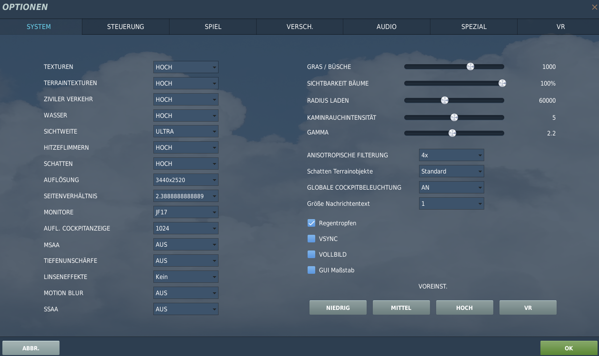

# Multimonitorsetup | Musteranpassungen | JF-17

## Monitorsetup DCS

C:\Users\<YOUR_USERNAME>\Saved Games\DCS\Config\MonitorSetup\JF17.lua

## JF-17 Musteranpassungen

### MFCD zur Anzeige bringen

DCSWorld\Mods\aircraft\JF-17\Cockpit\Scripts\MFCD\MFCD_init_CENTER.lua
DCSWorld\Mods\aircraft\JF-17\Cockpit\Scripts\MFCD\MFCD_init_LEFT.lua
DCSWorld\Mods\aircraft\JF-17\Cockpit\Scripts\MFCD\MFCD_init_RIGHT.lua

try_find_assigned_viewport('LEFT_MFCD') wurde auskommentiert
try_find_assigned_viewport('RIGHT_MFCD') wurde auskommentiert
try_find_assigned_viewport('CENTER_MFCD') wurde auskommentiert

### Trimmung anzeigen

DCSWorld\Mods\aircraft\JF-17\Cockpit\Scripts\ControlsIndicator\ControlsIndicator_page.lua

local cy = 0.2
local cx = 0

Damit man die Trimmung (STRG + ENTER) auf dem Monitor sehen kann.

## DCS-BIOS

1. Install DCS-BIOS https://github.com/DCSFlightpanels/dcs-bios MASTER
2. Kopieren der scripts Ordner und export.lua
3. connect-serial-port aus dem Verzeichnis ausführen!
4. DCS-BIOS mit der TF51 testen. Bindings von der P51

